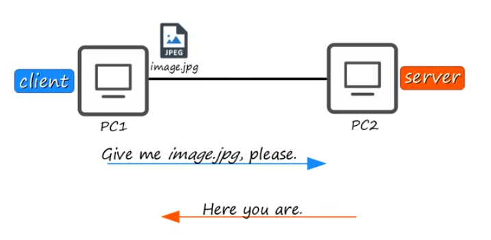
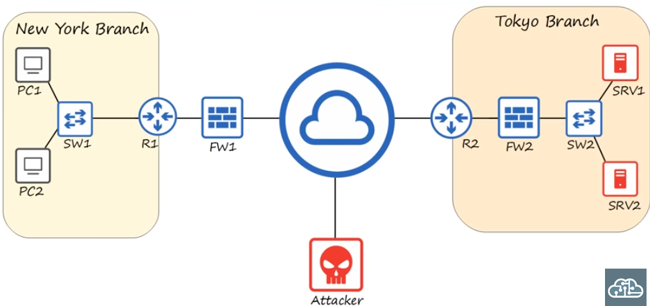

# [Day One - Network Devices](https://www.youtube.com/watch?v=H8W9oMNSuwo&list=PLxbwE86jKRgMpuZuLBivzlM8s2Dk5lXBQ)
* What is a network?
  * A computer network is a digital telecommunications network which allows nodes to share resources
* What is a node?
  * a router, switch, firewall, server, or client
* What is a client?
  * a client is a device that access a service made available by a server
* What is a server?
  * a server is a device that provides functions or services for clients
* Here is a simple network showing a server and client interacting
  * 
* What is a switch?
  * Switches have many interfaces/ports to connect end hosts to(Usually 24+)
  * Switches are used to forward traffic within a LAN(Local Area Network) i.e. PC_1 to PC_2 or PC_1 to printer_1 on the same LAN
  * However, switches cannot connect directly to the internet and cannot therefore send traffic over separate LANS. You must connect them to a router.
* What is a router?
  * Routers forward traffic over the internet to other routers, connecting separate LANs
  * routers have fewer network interfaces than switches
* What is a firewall?
  * firewalls mointor and control network traffic based on configured rules
  * they can be placed inside or outside the network. It can filter traffic before reaching the router, or after passing through the router.
  * next generation firewalls include more modern and advanced filtering capabilities
  * Network firewalls are hardware devices tat filter traffic between networks
  * host based firewalls are software applications that filter traffic entering and exiting a host machine, like a PC.  Even with a network firewall, it is useful to have a host based firewall on every machine as an extra line of defense.
* Here is another example of a network with all of its possible nodes included. 2 LANs, each with clients/servers, connected to switches, which connect to firewall and routers.
* 

## Quiz
### 1) Your company wants to purchase some network hardware to whih they can plug the 30 PCs in your department. Which type of network device is appropriate?
 a) router
 b) firewall
 c) switch
 d) server

### Answer: 
 b) switch: a switch is designed to connect many end hosts in the same LAN together

### 2) You received a video file from your friend’s Apple iPhone using AirDrop. What was his iPhone functioning as in that transaction?
 a) a server
 B) a client
 c) a local area network

### Answer: 
 a) server: his phone is providing the service for the the clients request

### 3) What is your computer or smartphone functioning as while you watch this video?
 a) server
 b) an end host
 c) client

### Answer: c) client: you are receiving the video service from a server

### 4) Your company wants to purchase some network hardware to connect its separate networks together. What kind of network device is appropriate?
 a) a firewall
 b) a host
 c) a LAN
 d) a router

### Answer: d) a router: a router forwards devices across the internet, connecting LANs/networks

### 5) Your company wants to upgrade its old network firewall that has been in use for several years to one that provides more advanced functions. What kind of firewall should they purchase?
 a) a host based firewall
 b) a next level firewall
 c) a next generation firewall
 d) a top layer firewall

# Answer: c) next gen firewall: this is a firewall that has both classic firewall features and advanced filtering functionalities.
